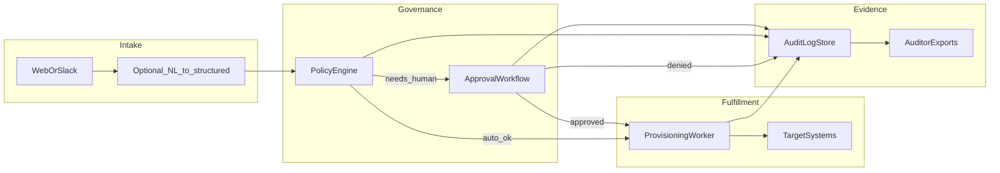

# AI “ServiceNow for the AI age” — Combined research & product vision

**Research snapshot date:** 4 April 2026  
**Authoring note:** This document is assembled from **public** marketing pages, vendor documentation, and open architecture descriptions. It does **not** claim confidential stack details. Statements are labeled **Verified (public)** when tied to a cited source, or **Inferred (industry pattern)** when describing typical engineering approaches.

**Chat archive:** For themes and Q&A from the conversations that produced this pack, see **[`CONVERSATION-SUMMARY.md`](./CONVERSATION-SUMMARY.md)**.

---

## Executive summary

**Market gap:** Enterprises and growing startups need the same *job* classic ITSM solves—**request → approve → fulfill → audit**—but for **cloud-native access**, **AI/agent tool permissions**, and **fast-moving teams** that resist grid-heavy portals.

**Combined vision (this doc merges competitor scan + your idea):** A **summary-first** request and approval product that:

- Intakes **human access** and **agent-capability** changes through web and chat surfaces.
- Routes decisions to **managers and resource owners** with plain-language **approval cards** (cost/risk/context).
- Executes **provisioning** via connectors (IdP, cloud, SaaS, Git, data platforms).
- Persists an **append-only-style audit trail** and ships **auditor-friendly exports** (SOC 2–oriented evidence packs).

**Positioning:** Not a full ServiceNow module clone on day one—“**ServiceNow-shaped** governance for how **AI-era** teams work,” with depth-first on one wedge (see [MVP vs platform](#mvp-vs-later-platform-scope)).

---

## How to read this document

| Label | Meaning |
|--------|---------|
| **Verified (public)** | Claim is supported by a linked primary or secondary public source (docs, official site). |
| **Inferred (industry pattern)** | Common architecture for this category; **not** confirmed for a specific vendor unless stated. |
| **Product vision (ours)** | Specification for *your* proposed product—not attributed to any vendor. |

---

## Part A — Competitive & adjacent landscape

### A.1 Agent governance / AI control-plane lane

Runtime enforcement on LLM traffic, tools/MCP, policies, human-in-the-loop, observability.

| Product | Primary job | How requests enter / enforce | Audit posture | Deployment | Verified (public) architecture / stack | What’s distinctive |
|---------|-------------|------------------------------|---------------|------------|----------------------------------------|---------------------|
| **AxonFlow** | Control plane for AI systems between apps, LLMs, tools | **Gateway mode:** pre-approval + client executes + post audit; **Proxy mode:** full governed execution path | Audit collection, workflow state in DB **Verified** | Self-hosted community; Evaluation/Enterprise tiers **Verified** | **Agent :8080**, **Orchestrator :8081**, **PostgreSQL**, **Redis**, Prometheus/Grafana in self-hosted model ([Architecture Overview](https://docs.getaxonflow.com/docs/architecture/overview)) | Two-phase policies (system on Agent; tenant on Orchestrator); MCP connector governance **Verified** |
| **APAAI** | Govern autonomous agent actions | **Observe** vs **Enforce**; pending approvals; dashboard; webhooks **Verified** | Claims immutable records, JSON/CSV export, SOC 2 **Verified (marketing)** | SaaS (tiers) **Verified (marketing)** | **Not public:** application language/framework. Protocol describes HTTP API + action lifecycle ([APAAI](https://www.apaai.ai/), [Protocol](https://apaaiprotocol.org/)) | Standardized Action → Policy → Evidence model **Verified** |
| **AgentGov** | Tracing + compliance framing for agents | SDK integrations; timeline views **Verified** | Audit trails, incidents, PII controls **Verified (marketing)** | Cloud beta **Verified (marketing)** | **Not public:** full runtime stack | EU AI Act–oriented messaging; multi-vendor SDK story **Verified** |
| **Clutch** | Real-time governance layer / proxy | Agent traffic through gateway; biometric/MFA approval **Verified (marketing)** | Immutable approval chain artifacts **Verified (marketing)** | **Not detailed** in sources consulted | **Not public:** implementation stack | Network-level emphasis; regulated-industry positioning **Verified** |
| **Govyn** | Network-layer governance + proxy | Open-source proxy + managed cloud; policy YAML **Verified** | Session replay, alerts, webhooks **Verified** | Cloud or self-hosted **Verified** | Mentions **Clerk** for auth **Verified** ([Features](https://govynai.com/features)); proxy on GitHub **Verified** | Approval queue in dashboard; semantic caching as add-on **Verified** |
| **Waxell** | Governance + observability for Python agents | Policies, budgets, registry, executions **Verified** | “Recorded immutably” **Verified (marketing)** | Beta **Verified** | **Not public:** service stack; Python agent focus **Verified** | Strong “controls what agents do next” vs trace-only **Verified** ([Overview](https://waxell.ai/overview)) |

### A.2 Identity / access governance lane

Classic “discover resource → request → approve → provision → review.”

| Product | Primary job | How requests enter | Who approves | Provisioning / enforcement | Audit | Verified (public) signals | What’s distinctive |
|---------|-------------|--------------------|--------------|----------------------------|-------|---------------------------|---------------------|
| **Lumos** | Autonomous identity / access platform | **AI bot, Slack, web catalog, CLI** **Verified** | Manager + automated reviews **Inferred** + **Verified** “access reviews” | **Provisioning engine**, SaaS/cloud connectors, SCIM/API **Verified** | Compliance-oriented reviews **Verified** | Modular arch: provisioning engine, self-serve layer, connectors, optional on-prem agent; ITSM sync (Jira, ServiceNow) **Verified** ([Reference Architecture](https://developers.lumos.com/docs/reference-architecture), [Slack](https://www.lumos.com/integrations/slack)) | AI-assisted governance messaging; broad connector strategy **Verified** |
| **ConductorOne** | Identity governance + automations | **Requestable automations** (on-demand) **Verified** | Policy-driven human or auto-approve **Verified** | Executes steps post-approval **Verified** | End-to-end audit log **Verified** | Custom request forms; governance gate; “On demand” trigger **Verified** ([Requestable automations](https://www.conductorone.com/docs/product/admin/automation-actions)) | Frames IT/back-office tasks as governed services **Verified** |
| **Opal** | Self-service access catalog | Web catalog; bulk select **Verified** | Multi-stage reviewers (manager, owner); Slack or web **Verified** | Configurations for JIT/extension **Inferred** + **Verified** docs | Request audit trail **Inferred** | OpalScript automation on reviews **Verified**; reviewer config **Verified** ([Docs](https://docs.opal.dev/docs/best-practices-for-access-requests)) | Deep reviewer configurability **Verified** |

### A.3 Adjacent substitutes (not direct clones)

**Verified (public) category facts only where cited; stacks generally Inferred.**

- **Modern ITSM / ITSM-lite:** Atlassian **Jira Service Management**, **Freshservice**—ticketing + SLAs + integrations; not agent-native **Inferred (category)**.
- **LLM observability:** LangSmith-class tools—traces, evals, monitoring; **complement** governance but rarely replace access ticketing **Inferred (category)**.
- **Workflow engines:** Temporal, Inngest—durable workflows **Inferred**; often **part of** fulfillment, not the full portal.
- **Legacy incumbent:** **ServiceNow**—broad modules; AI features added over time **Inferred (category)**.

---

## Part B — How these systems are “made” (Verified vs Inferred)

### B.1 Verified (public) engineering patterns

| Vendor | What is actually documented |
|--------|----------------------------|
| **AxonFlow** | Split **Agent** vs **Orchestrator** services; **Postgres** for policy/audit/workflow; **Redis** for limits/cache; **Gateway vs Proxy** integration ([Architecture Overview](https://docs.getaxonflow.com/docs/architecture/overview)). |
| **Lumos** | **Provisioning engine** centralizes access events; **multiple UX surfaces**; **connector** model; optional **on-prem agent**; **ITSM** integrations ([Reference Architecture](https://developers.lumos.com/docs/reference-architecture)). |
| **ConductorOne** | **Requestable automation** lifecycle: design → scope audience/forms → governance gate → execute + log ([Requestable automations](https://www.conductorone.com/docs/product/admin/automation-actions)). |
| **Govyn** | **Proxy** enforcement, **YAML policies**, **Clerk** auth mention ([Features](https://govynai.com/features)). |

### B.2 Inferred (industry pattern) — typical stack for this class of product

These patterns appear repeatedly in SaaS governance products; **they are not confirmed per vendor** unless listed in §B.1.

1. **Multi-tenant web dashboard** (orgs, RBAC, SSO).
2. **API + webhook layer** for integrations and agent-initiated requests.
3. **PostgreSQL** (or equivalent) for relational core + **append-only audit** tables or event store.
4. **Queue / worker tier** for **async provisioning**, retries, idempotency keys.
5. **Policy evaluation** path optimized for latency (often cache/Redis) when inline with requests.
6. **Chat adapters** (Slack/Teams) using OAuth + interactive messages.
7. **Secrets vault** (KMS, vault integration) for connector credentials.

---

## Part C — Merged product vision (your idea, specified)

### C.1 Thesis

**Product vision (ours):** A **new ticketing and approval layer** for the **AI age**: **summary-first** for approvers, **structured and queryable** underneath for security and compliance, with **automation** that actually grants or revokes access—and **exports** that map to **SOC 2–style** evidence requests.

### C.2 Surfaces — how people access it

| Surface | Role | Product vision (ours) |
|---------|------|------------------------|
| **Web app** | Requester, approver, admin | Primary; responsive; strong keyboard + screen-reader support **Inferred (best practice)** |
| **Slack / Microsoft Teams** | Notifications + approve/deny | High value for startups; interactive buttons + link to detail view **Product vision (ours)** |
| **Email** | Digest / fallback | Use for reminders; avoid sole channel for high-risk actions unless phishing-resistant flows **Product vision (ours)** |
| **HTTP API + webhooks** | Internal tools, agents | Agents *initiate* requests; **never** self-approve sensitive scopes without human gate **Product vision (ours)** |
| **CLI (later)** | Power users | Optional; mirrors Conductor/Lumos pattern of multi-surface access **Inferred (pattern)** |

**Dashboard-based?** **Yes, as hub:** queues (“My requests,” “Pending approvals,” “Admin connectors”), activity feed, policy catalog, reporting. Chat surfaces are **views** into the same records—not a second source of truth **Product vision (ours)**.

### C.3 Creating a ticket / request (requester)

1. **Intent selection:** e.g. “SaaS access,” “Cloud IAM,” “Data read,” “Agent tool allowlist,” “Model/route change.”
2. **Dynamic form:** fields depend on intent + org policy (validated server-side).
3. **Optional natural language assist:** user types free text; backend runs **schema-constrained extraction** (LLM → JSON → **Zod**/equivalent validation). **Authorization always uses structured fields**, not raw LLM output **Product vision (ours)**.
4. **Live preview:** show **estimated cost**, **data classification**, **blast radius**, **suggested approvers** **Product vision (ours)**.
5. **Submit:** creates **Request** record + **AuditEvents** (`created`, `fields_hash`, `policy_version`) **Product vision (ours)**.

### C.4 Approval — how it is routed and delivered

| Step | Product vision (ours) |
|------|------------------------|
| **Routing** | Primary: **manager** from IdP; secondary: **resource owner**; tertiary: **security** escalation on high risk |
| **Rules engine** | Risk scores; optional **auto-approve** only for pre-registered **low-risk bundles** |
| **Delivery** | In-app notification; Slack/Teams DM or channel mention; email digest |
| **SLA** | Optional due times; escalate if stale **Inferred (ITSM pattern)** |
| **Decision** | Approve / Deny / **Needs info** (loops to requester) |

### C.5 Approval summary — what the approver sees

**Product vision (ours)** — example card copy (templates):

**Template A — Human access**

```text
Summary for approval
Requester: Govind (Engineering)
Asking for: Read-only BigQuery on project “analytics-prod”
Reason: Build weekly revenue dashboard for Series B diligence
Estimated cost: ~$45/mo (from org FinOps policy v3)
Data risk: Medium (PII column “email” exists in dataset X — masked read role proposed)
Approver: You (manager) + @data-owner (Sarah)
Expires if approved: 7 days (JIT)

Policy checks: PASS (SOC2 template pack A)
[ Approve ] [ Deny ] [ Ask a question ]
```

**Template B — Agent capability**

```text
Summary for approval
Agent: “Support-Triage-v2” (staging)
Wants: New tool — “Salesforce.case.update” + scope “cases:read/write”
Blast radius: ~2k support cases/week; no bulk export API in proposal
Risk: High (write to CRM)

Policy checks: FLAG — write scope requires security on CC
[ Approve write ] [ Approve read-only instead ] [ Deny ]
```

**Template C — Cost threshold**

```text
Summary for approval
Requester: Govind
Resource: Create Azure VM (Standard_D8s_v5) in subscription “dev-sandbox”
Estimated cost: ~$280/mo if left on 24/7 (policy suggests auto-shutdown tag)
Approver: Finance delegate + Engineering manager (serial)

[ Approve with shutdown tags ] [ Deny ]
```

Optional **AI assist** may suggest wording or **conditions**; it **cannot** override failing policy checks **Product vision (ours)**.

### C.6 Onboarding — how the org “knows what to offer”

**Product vision (ours)** + **Inferred (pattern)**:

1. **Connect IdP** (Okta / Entra): SSO, groups, manager attribute.
2. **Install connectors** (cloud, Git, key SaaS): OAuth / service principals; **least-privilege connector** per system.
3. **Import or define catalog:** role bundles (“Analyst read pack,” “On-call prod pack”); map to external IDs.
4. **Approval graph:** set default approvers per resource class; fallback chains.
5. **Pilot bundle:** start with 3–5 high-volume request types **Product vision (ours)**.

### C.7 Connecting to target software (integrations)

| Mechanism | Use | Product vision (ours) |
|-----------|-----|------------------------|
| **OAuth / OIDC** | SaaS with user consent flows | Store refresh tokens in KMS-backed secret store |
| **Service principals** | Cloud APIs | Scoped IAM roles; short-lived creds where possible |
| **SCIM** | Provision users/groups from IdP | **Inferred** when IdP is source of truth |
| **Webhooks** | Event-driven sync | Outbound events for SIEM / SOAR **Inferred** |
| **Custom HTTP actions** | Long tail | Admin-defined templates with secrets + idempotency **Product vision (ours)** |

### C.8 Fulfillment — granting access after approval

1. Worker picks **Approved** requests from queue.
2. **Idempotent** connector calls (e.g. `PUT membership` with expected version).
3. Write **AuditEvents**: `provision_started`, `provision_succeeded` or `failed` + error class.
4. **Time-bound:** store `expires_at`; schedule **revocation** job **Product vision (ours)**.
5. On **Deny** or **withdraw**, no side effects; audit closed **Product vision (ours)**.

### C.9 Audit — storage and exports

| Aspect | Product vision (ours) |
|--------|------------------------|
| **Storage** | **PostgreSQL** (or compatible) for core entities; **append-only** `audit_events` table; object store for large attachments **Inferred (pattern)** |
| **Immutability** | No updates/deletes on audit rows; corrections via compensating entries **Product vision (ours)** |
| **Retention** | Tiered (e.g. 90d hot, 1y warm, archive); customer-configurable for enterprise **Product vision (ours)** |
| **Exports** | CSV + PDF “evidence packs”: access grants in range, approvers, connector proofs, policy versions **Product vision (ours)** |

### C.10 End-to-end flow (diagram)



---

## Part D — Recommended tech stack (MVP; Product vision + Inferred)

**Label:** **Recommendation for your build**, not a vendor stack claim.

| Layer | Choice | Rationale |
|-------|--------|-----------|
| **UI** | **Next.js** (App Router) + **React** + **TypeScript** + **Tailwind** | Fast iteration, SSR, ecosystem **Inferred** |
| **API** | **Node** or **Bun** + **Zod** at boundaries | Type-safe validation **Inferred** |
| **Auth** | **Clerk** / **Auth.js** / **Better Auth** + **SSO** path for enterprise | Matches common startup → enterprise path **Inferred** |
| **DB** | **PostgreSQL** | Fits audit + relational model; **Verified** pattern in AxonFlow docs for analogous workloads |
| **Queue** | **BullMQ** + Redis or managed queue | Retries, DLQ **Inferred** |
| **AI** | **OpenRouter** or direct APIs; **structured output** + validation | Summaries + extraction only; **no** autonomous grant **Product vision (ours)** |
| **Observability** | OpenTelemetry + structured logs | Operations maturity **Inferred** |

### AI features (guardrails) — Product vision (ours)

- **Summarization** for approver cards from structured request + live connector metadata.
- **Extraction** NL → fields with **strict schema**; human confirms ambiguous extractions.
- **Policy copilot** for admins (suggest bundles); **never** sole authority for enforcement.
- **RAG** on internal policy PDFs **optional**; separate authorization path from vector retrieval **Product vision (ours)**.

---

## Part E — Realistic “proactive helper” (company knowledge + ticket offer)

This is the feature you described: the requester **does not need to know internal process**; the product **explains how access works** using **company knowledge**, then asks: **“Should I create this request for you?”**

**Product vision (ours)** — rules that keep it **realistic in production**:

| Rule | Why |
|------|-----|
| **Ground answers in retrieved docs** | Answers should cite or be limited to **indexed company content** (wiki, Notion export, runbooks). If nothing is retrieved → **say you don’t know** and link a human channel. |
| **Map intent to an allowed ticket template** | The model **never invents** a new access type. It only selects from **admin-defined** request types + fields (validated with **Zod**/etc.). |
| **Two-step ticket creation** | (1) Show a **structured summary** of what will be filed. (2) User taps **Confirm create**. No silent ticket creation from chat. |
| **Chat cannot approve or provision** | Only the **approval workflow + connectors** change real permissions. Chat is **triage and drafting**. |
| **Confidence and escalation** | If extraction confidence is low or policies conflict → **ask clarifying questions** or **route to an admin queue**; don’t guess. |
| **Auditing the assistant** | Log: user message hash, retrieved doc IDs, proposed payload, confirm/discard. Helps debug wrong advice and supports governance. |
| **Optional: Langfuse or similar** | Trace LLM/RAG steps in dev and early prod (**see Part F**). |

**Typical UX flow**

1. User: “I need to see customer data for a bug.”  
2. System retrieves **relevant policy chunks** → explains **allowed path** (e.g. read-only sandbox, manager approval, time-bound).  
3. System: “This usually needs **BigQuery read-only** for 7 days. **Create request?**”  
4. User confirms → **same Request record** as web form would create → normal **approval + fulfillment + audit**.

---

## Part F — Open-source catalog by layer (3–5 options each + original picks)

**Maps to:** [Part D — Recommended tech stack](#part-d--recommended-tech-stack-mvp-product-vision--inferred) (UI, API, Auth, DB, Queue, AI, Observability) plus fulfillment, policy, search/RAG, chat surfaces, and audit.

**Methods:** For each layer we list **three to five** actively used OSS repos you can **learn from, integrate, or run**. This is **not** an exhaustive GitHub crawl; **verify license and security** before embedding code. **Star counts** change; links are the stable anchor.

**Legend:** **Original pick** = repo already called out in earlier research in this doc.

---

### F.1 Web dashboard / admin UI framework

| Repository | License (verify) | Why it fits | Original? |
|------------|------------------|-------------|-------------|
| [vercel/next.js](https://github.com/vercel/next.js) | MIT | App Router, SSR; aligns with **Part D** UI recommendation. | **Yes** |
| [remix-run/remix](https://github.com/remix-run/remix) | MIT | Full-stack React, solid forms/actions for ticketing flows. | |
| [refinedev/refine](https://github.com/refinedev/refine) | MIT | Admin/dashboard scaffolding, data tables, auth hooks—fast for internal ops UIs. | |
| [TanStack/router](https://github.com/TanStack/router) + Vite | MIT | If you want SPA-first routing; pair with your API (more assembly work than Next). | |

---

### F.2 HTTP API, validation, and RPC

| Repository | License | Why it fits | Original? |
|------------|---------|-------------|-------------|
| [colinhacks/zod](https://github.com/colinhacks/zod) | MIT | Schema validation at API boundary (Part D); use with TS everywhere. | **Yes** (Part D) |
| [trpc/trpc](https://github.com/trpc/trpc) | MIT | End-to-end typesafe APIs from monorepo; great for dashboard + workers sharing types. | |
| [honojs/hono](https://github.com/honojs/hono) | MIT | Ultrafast edge-friendly HTTP layer (Bun/Workers/Node). | |
| [fastify/fastify](https://github.com/fastify/fastify) | MIT | Mature Node HTTP server, plugins, schema-first. | |
| [nestjs/nest](https://github.com/nestjs/nest) | MIT | Opinionated modular backend if team prefers OO + DI over minimal routers. | |

---

### F.3 Authentication, SSO, and identity (self-hosted / headless)

| Repository | License | Why it fits | Original? |
|------------|---------|-------------|-------------|
| [keycloak/keycloak](https://github.com/keycloak/keycloak) | Apache-2.0 | Full IAM, SAML/OIDC, brokering; common **self-hosted** SSO story. | **Yes** |
| [ory/kratos](https://github.com/ory/kratos) | Apache-2.0 | Headless identity (login, MFA, flows); integrate with your UI. | |
| [ory/hydra](https://github.com/ory/hydra) | Apache-2.0 | OAuth2/OIDC provider layer; pairs with Kratos for enterprise patterns. | |
| [casdoor/casdoor](https://github.com/casdoor/casdoor) | Apache-2.0 | IAM UI + SSO portal; quick if you want batteries-included portal. | |
| [authelia/authelia](https://github.com/authelia/authelia) | Apache-2.0 | SSO + access control in front of apps; less “product IAM,” more perimeter auth. | |

*(Part D also mentions **Clerk / Auth.js / Better Auth**—those are often **managed** or lighter OSS; fine for MVP if you accept vendor coupling.)*

---

### F.4 Database, migrations, ORM

| Repository | License | Why it fits | Original? |
|------------|---------|-------------|-------------|
| [postgres/postgres](https://github.com/postgres/postgres) | PostgreSQL License | System of record for requests, approvals, audit events. | **Yes** (concept) |
| [drizzle-team/drizzle-orm](https://github.com/drizzle-team/drizzle-orm) | Apache-2.0 | Lightweight SQL-first TS ORM; good control over migrations. | |
| [prisma/prisma](https://github.com/prisma/prisma) | Apache-2.0 | Schema-first, fast team velocity; watch migration workflow in prod. | |
| [supabase/supabase](https://github.com/supabase/supabase) | Apache-2.0 | Postgres + auth + realtime + tooling; accelerate MVP. | **Yes** |

---

### F.5 Background jobs and message queues

| Repository | License | Why it fits | Original? |
|------------|---------|-------------|-------------|
| [taskforcesh/bullmq](https://github.com/taskforcesh/bullmq) | MIT | Redis-backed jobs/retries; matches **Part D** “Queue” suggestion. | **Yes** |
| [hatchet-dev/hatchet](https://github.com/hatchet-dev/hatchet) | MIT | Postgres-backed **durable tasks + DAG workflows** + dashboard; middle ground between raw queues and Temporal. | |
| [riverqueue/river](https://github.com/riverqueue/river) | MPL-2.0 | **Postgres-native** queue (Go); transactional enqueue; great if core is Go—less if stack is pure Node. | |
| [nats-io/nats-server](https://github.com/nats-io/nats-server) | Apache-2.0 | Lightweight messaging; streams for event fan-out (audit, webhooks). | |
| [apache/kafka](https://github.com/apache/kafka) | Apache-2.0 | Event log at scale; heavier ops—usually later-stage than BullMQ. | |

---

### F.6 Durable workflows (multi-step provisioning, compensation)

| Repository | License | Why it fits | Original? |
|------------|---------|-------------|-------------|
| [temporalio/temporal](https://github.com/temporalio/temporal) | MIT | Industry standard **durable execution**; recoverable long runs. | **Yes** |
| [temporalio/sdk-typescript](https://github.com/temporalio/sdk-typescript) | MIT | TS workers aligned with Next/Node stack. | **Yes** |
| [conductor-oss/conductor](https://github.com/conductor-oss/conductor) | Apache-2.0 | JSON workflow defs, broad SDKs; actively maintained OSS fork after Netflix archive. | |
| [hatchet-dev/hatchet](https://github.com/hatchet-dev/hatchet) | MIT | Also listed under jobs—DAG workflows overlap this layer. | |

**Pragmatic:** start **BullMQ**; add **Temporal** or **Hatchet** when branching/compensation becomes painful.

---

### F.7 Policy-as-code (approval rules, risk, separation of duties)

| Repository | License | Why it fits | Original? |
|------------|---------|-------------|-------------|
| [open-policy-agent/opa](https://github.com/open-policy-agent/opa) | Apache-2.0 | **Rego** policies over JSON; CNCF graduated; central policy API. | **Yes** |
| [casbin/casbin](https://github.com/casbin/casbin) | Apache-2.0 | RBAC/ABAC in-process (many language ports); good when policies live **inside** each service. | |
| [cerbos/cerbos](https://github.com/cerbos/cerbos) | Apache-2.0 | PDP for application authZ with YAML policies + audit logs; alternative mental model to OPA. | |
| [Permify/permify](https://github.com/Permify/permify) | Apache-2.0 | Open-source authorization service (ReBAC-style); overlaps with F.8. | |

---

### F.8 Fine-grained authorization (ReBAC / relationships)

| Repository | License | Why it fits | Original? |
|------------|---------|-------------|-------------|
| [openfga/openfga](https://github.com/openfga/openfga) | Apache-2.0 | Google Zanzibar–style checks; **owner / delegate / break-glass** graphs. | **Yes** |
| [authzed/spicedb](https://github.com/authzed/spicedb) | Apache-2.0 | Same problem space as OpenFGA; gRPC-first. | **Yes** |
| [Permify/permify](https://github.com/Permify/permify) | Apache-2.0 | Relationship engine + dashboard; evaluate if modeling matches your tenancy. | |

Pick **one** of OpenFGA vs SpiceDB vs Permify—do not combine casually.

---

### F.9 Full-text and hybrid search (company docs for RAG and catalog search)

| Repository | License | Why it fits | Original? |
|------------|---------|-------------|-------------|
| [meilisearch/meilisearch](https://github.com/meilisearch/meilisearch) | MIT | Simple, fast **typo-tolerant** full-text; great doc search. | **Yes** |
| [typesense/typesense](https://github.com/typesense/typesense) | GPL-3.0 | Fast search + **vector/hybrid** features; **check GPL** implications for your distribution model. | |
| [elastic/elasticsearch](https://github.com/elastic/elasticsearch) | SSPL / Elastic-2.0 (verify) | Powerful but heavier ops; **license** changed—read carefully for SaaS. | |
| [quickwit-oss/quickwit](https://github.com/quickwit-oss/quickwit) | Apache-2.0 | Cloud-native search/analytics on object storage; alternative architecture. | |

---

### F.10 Vector stores and embeddings (RAG retrieval)

| Repository | License | Why it fits | Original? |
|------------|---------|-------------|-------------|
| [pgvector/pgvector](https://github.com/pgvector/pgvector) | PostgreSQL | Vectors **in Postgres**—minimal ops; pairs with your core DB. | **Yes** |
| [qdrant/qdrant](https://github.com/qdrant/qdrant) | Apache-2.0 | High-performance Rust engine; strong filtering + hybrid. | |
| [weaviate/weaviate](https://github.com/weaviate/weaviate) | BSD-3-Clause | Object + vector + modules; good if you want batteries-included RAG tooling. | |
| [milvus-io/milvus](https://github.com/milvus-io/milvus) | Apache-2.0 | Scale-out vector DB for large corpora. | |
| [chroma-core/chroma](https://github.com/chroma-core/chroma) | Apache-2.0 | Developer-friendly embedded/server modes for experimentation. | |

---

### F.11 LLM / RAG observability (Proactive helper, Part E)

| Repository | License | Why it fits | Original? |
|------------|---------|-------------|-------------|
| [langfuse/langfuse](https://github.com/langfuse/langfuse) | MIT (verify) | Traces, prompts, eval hooks; OSS + hosted. | **Yes** |
| [Arize-ai/phoenix](https://github.com/Arize-ai/phoenix) | OSS (verify at repo) | Tracing + eval + datasets; OpenTelemetry-friendly. | |
| [openlit/openlit](https://github.com/openlit/openlit) | Apache-2.0 | OTel-native AI metrics/traces; many provider integrations. | |
| [arize-ai/openinference](https://github.com/arize-ai/openinference) | Apache-2.0 | Instrumentation conventions that pair with Phoenix or any OTel backend. | |

---

### F.12 Chat ops: Slack, Teams, email bots

| Repository | License | Why it fits | Original? |
|------------|---------|-------------|-------------|
| [slackapi/bolt-js](https://github.com/slackapi/bolt-js) | MIT | Official **Slack** app framework (buttons, modals, events) for approvals-in-chat. | |
| [microsoft/botbuilder-js](https://github.com/microsoft/botbuilder-js) | MIT | **Microsoft Teams** / Bot Framework SDK for Node. | |
| [mattermost/mattermost](https://github.com/mattermost/mattermost) | AGPL-3.0 / other (verify) | Self-hosted chat; only if customers refuse Slack/Teams—**license** heavy. | |

---

### F.13 Audit, tamper evidence, and compliance-oriented storage (optional)

| Repository | License | Why it fits | Original? |
|------------|---------|-------------|-------------|
| **Append-only Postgres + signed exports** | N/A | Simplest MVP: immutable **insert-only** audit table, WORM object storage for exports. | **Pattern** |
| [codenotary/immudb](https://github.com/codenotary/immudb) | Apache-2.0 | **Cryptographically verifiable** log/db when customers demand tamper detection beyond RDBMS. | |

---

### F.14 ITSM / knowledge **sources** (integrate or learn patterns—not always embed)

| Repository | License | Why it fits | Original? |
|------------|---------|-------------|-------------|
| [zammad/zammad](https://github.com/zammad/zammad) | **AGPL-3.0** | Rich ticketing patterns; **do not fork** without legal review. | **Yes** |
| [apache/answer](https://github.com/apache/answer) | Apache-2.0 | Q&A/help center content you can **index** for RAG. | **Yes** |
| [outline/outline](https://github.com/outline/outline) | BSL (verify) | Wiki sync/index; check license for commercial use. | **Yes** |

---

### F.15 Suggested stack paths (quick decisions)

| Stage | Reasonable combo |
|-------|------------------|
| **Fastest MVP** | Next.js + Zod + Postgres + **BullMQ** + **pgvector** or **Meilisearch** + **Bolt** for Slack. |
| **Strong governance** | Above + **OPA** + **OpenFGA** (if relationship checks matter) + **Langfuse** or **Phoenix**. |
| **Heavy provisioning reliability** | Swap ad-hoc scripts for **Temporal** (or **Hatchet** if you want Postgres-native ops). |
| **Self-hosted enterprise SSO** | **Keycloak** or **Ory** (Kratos+Hydra) alongside your product auth. |
| **Tamper-evident audit** | Start append-only + object-lock exports; add **immudb** if a customer contract demands cryptographic audit chains. |

---

## MVP vs later platform scope

### MVP (depth-first)

**Product vision (ours):**

- One IdP (e.g. Okta *or* Entra).
- 2–3 connectors (e.g. **GitHub**, **Google Workspace** or **AWS** subset).
- Web UI + **one** chat surface (Slack *or* Teams).
- **Request → approve → provision → audit export CSV**.
- **No** full CMDB; **lightweight** resource catalog only.
- **Proactive chat/RAG helper (Part E):** optional **after** core request/approve/provision path is stable—same backend ticket record, **confirm-to-create** only.

### Later platform

- Full connector library, **access reviews** campaigns, **JIT** depth, mobile, SOC2-type report templates, multi-region residency, agent-runtime **proxy** mode (compete with Govyn/AxonFlow lane) **Product vision (ours)**.

---

## Open risks

1. **Incumbents:** Lumos, ConductorOne, Opal own access; agent proxies own runtime—must **wedge** clearly **Inferred**.
2. **Integration long tail:** each connector is ongoing cost **Inferred**.
3. **Enterprise gates:** SAML, SCIM, DPA, penetration expectations **Inferred**.
4. **AI trust:** summaries must be **grounded** in structured data to avoid approver blind spots **Product vision (ours)**.
5. **Regulatory drift:** EU AI Act / sector rules—position exports as **evidence aid**, not legal advice **Product vision (ours)**.

---

## Reference links (public sources used)

- AxonFlow architecture: https://docs.getaxonflow.com/docs/architecture/overview  
- APAAI: https://www.apaai.ai/ — Protocol: https://apaaiprotocol.org/  
- AgentGov: https://agentgov.co/  
- Clutch: https://clutchengaged.com/ — https://www.clutch.security/platform/agentic-ai-governance  
- Govyn features: https://govynai.com/features  
- Waxell overview: https://waxell.ai/overview  
- Lumos reference architecture: https://developers.lumos.com/docs/reference-architecture  
- Lumos Slack: https://www.lumos.com/integrations/slack  
- ConductorOne requestable automations: https://www.conductorone.com/docs/product/admin/automation-actions  
- Opal access requests docs: https://docs.opal.dev/docs/best-practices-for-access-requests  

---

## Document control

| Version | Date | Notes |
|---------|------|-------|
| 1.0 | 2026-04-04 | Initial combined research + vision pack |
| 1.1 | 2026-04-04 | Part E proactive assistant (realistic guardrails); Part F curated OSS building blocks |
| 1.2 | 2026-04-04 | Part F expanded: per-layer 3–5 OSS options; original picks marked in tables |
| 1.3 | 2026-04-04 | Link + companion `CONVERSATION-SUMMARY.md` (chat themes archive) |
