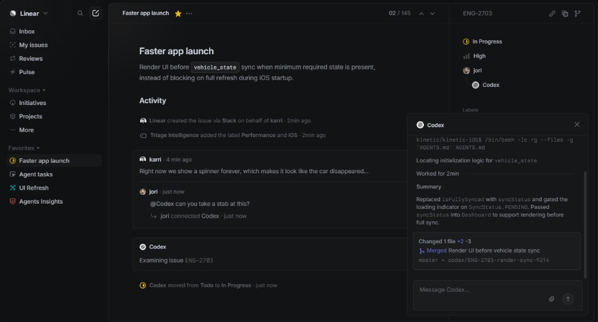
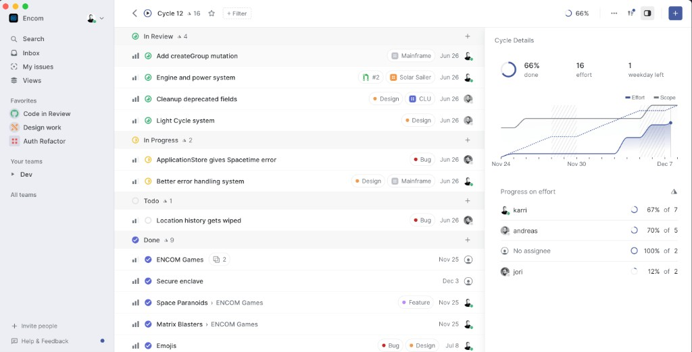
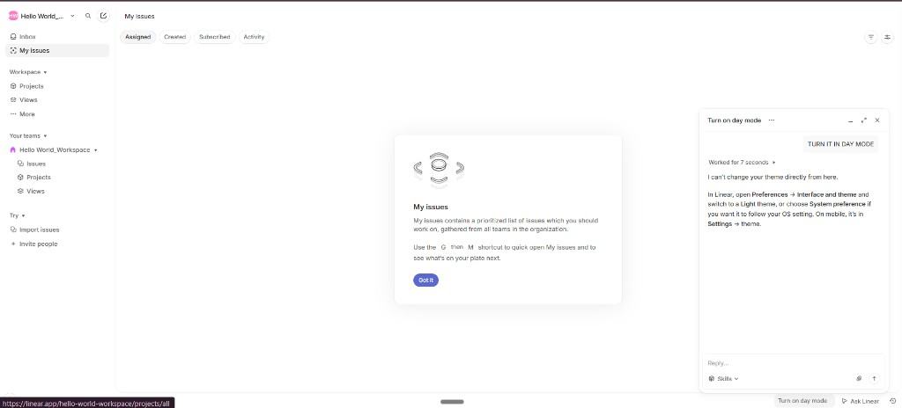

# UX/UI inspiration: Linear-style patterns for AI Governance

This document captures **design patterns observed in [Linear](https://linear.app/)** (product UI and marketing surfaces) and **official Linear brand tokens** where published. It is **reference material for building our own UI**, not a claim of affiliation. Linear’s logos and brand assets are proprietary; see their [Brand Guidelines](https://linear.app/docs/brand-guidelines) before using any official assets.

---

## 1. Reference screenshots (this repo)

Use these as visual benchmarks when implementing layouts, density, and hierarchy.

### 1.1 Dark theme — issue detail + agent panel

Dense issue view: title hierarchy, activity stream, right-hand properties, and a **floating agent workspace** with terminal-style output and progress feedback.

**Takeaways**

- **Canvas:** Very dark background; panels slightly separated by **1px hairlines**, not heavy shadows.
- **Typography:** Strong title (large, semibold); body and metadata **muted** (gray); inline **monospace** for identifiers (e.g. `vehicle_state`).
- **Status:** Small, legible **icons + labels** (e.g. “In Progress”) with **accent color** (yellow in this frame) used sparingly.
- **Agent UX:** Compact **log / terminal block**, progress hint (“Worked for …”), then a **summary card**; input anchored at bottom — user never leaves issue context (similar idea: approve request + agent trace in a drawer).

### 1.2 Light theme — cycle / board density

High-information list: grouped by status, tight row rhythm, label **pills**, id + date + assignee avatar on the row.

**Takeaways**

- **Sidebar:** Light wash distinct from main surface (subtle contrast, not a hard border stack).
- **Row rhythm:** **~32–40px** row height feel; **11–13px** secondary metadata; title one step bolder than metadata.
- **Pills:** Rounded-full or **large radius**; **dot + label**; background is a **tint** of the label hue at low saturation.
- **Progress:** **Donut / ring** and small **sparkline-style** charts for at-a-glance cycle health — good analogy for “approval queue health” or SLA.

### 1.3 Light theme — “My issues” + tabs + empty state

Tabbed sub-navigation, **pill tabs**, centered **empty state** with illustration, single **primary CTA**, floating help/agent widget.

**Takeaways**

- **Pills for tabs:** Active tab = filled neutral background; inactive = ghost.
- **Empty state:** One short headline, one paragraph, **one primary button** (saturated accent); optional shortcut hint in monospace or `<kbd>` style.
- **Floating panel:** Rounded, light shadow, clear header with window controls — pattern fits “audit trail” or “policy explanation” overlays.

---

## 2. Official Linear brand tokens (published)

From [Linear Brand Guidelines](https://linear.app/docs/brand-guidelines) (accessed for this doc):

| Token | RGB | Hex | Usage note |
|--------|-----|-----|------------|
| Mercury White | 244, 245, 248 | `#F4F5F8` | Light-mode friendly surface / wordmark on dark |
| Nordic Gray | 35, 35, 38 | `#222326` | Dark accent / wordmark on light |
| Primary brand | *desaturated blue* | *(see brand zip)* | Marketing backgrounds; product accent is often a **bluer violet** in-app |

**Brand usage principle (quoted intent):** generous whitespace so layouts “have room to breathe” — don’t cram metadata against chrome.

---

## 3. Observed typography scale (from screenshots — implement, don’t copy trademark assets)

Linear’s app does not publish a full type scale in the brand page above. The table below is an **implementation-ready approximation** aligned with what appears in the references (similar to **Inter** / system UI sans, **JetBrains Mono** / **Geist Mono** for code).

| Role | Approx size | Weight | Line height | Letter-spacing |
|------|-------------|--------|-------------|----------------|
| App / page title | `15px`–`18px` | `600` | `1.25` | `-0.01em` |
| Section header | `13px`–`14px` | `600` | `1.3` | `0` |
| Body | `13px` | `400` | `1.45` | `0` |
| Secondary / meta | `12px` | `400`–`500` | `1.4` | `0.01em` (optional caps labels) |
| Table / list row primary | `13px` | `500` | `1.35` | `0` |
| Monospace / ids / shortcuts | `12px` | `400` | `1.4` | `0` |
| Micro copy (timestamps) | `11px`–`12px` | `400` | `1.35` | `0` |

**Rules**

- Prefer **weight + size** over color for hierarchy; use **one** saturated accent for primary actions only.
- Keep **body ≥ 12px** for accessibility; use `11px` only for non-essential meta.

---

## 4. Spacing, radius, borders (Linear-like)

| Token | Suggested value | Notes |
|--------|-----------------|--------|
| Base grid | `4px` | All padding/margin multiples of 4 |
| Dense stack | `8px`, `12px` | Form fields, list gaps |
| Section | `16px`, `24px` | Card insets, page gutters |
| Row height | `32px`–`40px` | Interactive list rows |
| Border | `1px solid` | `opacity ~6–12%` of foreground on light; `~8–14%` on dark |
| Radius | `6px`–`10px` | Inputs, buttons, small cards |
| Radius (pills) | `9999px` | Tabs, labels |

---

## 5. Color system (product UI — inspired, not official Linear app theme)

Use CSS variables so light/dark match our brand without cloning Linear.

**Light (example)**

- Background: `#FFFFFF` or `#FAFAFB`
- Sidebar wash: `#F4F5F8` (Mercury-adjacent)
- Text primary: `#0B0D0E` to `#1A1C1E`
- Text secondary: `#6B7280` range
- Border: `rgba(15, 23, 42, 0.08)`
- Primary action: blue-violet **~`#5E6AD2`–`#6E5ED6`** (common in Linear-style UIs; adjust for your brand)

**Dark (example)**

- Background: `#0C0C0E`–`#101014`
- Panel: `#141418`
- Text primary: `#F4F4F5`
- Text secondary: `#A1A1AA`
- Border: `rgba(255, 255, 255, 0.08)`

**Semantic accents** (status chips only)

- In progress / warning: amber dot
- Done / success: green dot
- Risk / blocked: red dot (use sparingly)

---

## 6. UX patterns to steal (ethically: behavior, not assets)

1. **Summary-first detail**: Title + one paragraph + structured properties — aligns with our **approval card** philosophy.
2. **Activity as timeline**: Human + system events in one feed — maps to **audit trail** on a request.
3. **Contextual agent**: Slide-over or floating panel with **trace** (what ran) + **outcome** — maps to **policy / fulfillment** transparency.
4. **Grouped queues**: Bucket by **status** with counts — maps to **Approvals** and **My requests**.
5. **Keyboard culture**: Surface shortcuts in empty states — adopt for power users (optional phase).

---

## 7. Mapping to our AI Governance MVP (actionable)

| Linear pattern | Our app surface |
|----------------|-----------------|
| Issue row | Request row: type, status pill, requester, updated |
| Issue detail + activity | `/requests/[id]` with audit timeline |
| Right properties | Approver panel, risk summary, IDs |
| Cycle health | Admin dashboard phase: open vs approved vs fulfilled |
| Agent panel | Future: policy decision + connector log (or webhook delivery status) |

---

## 8. References

- Product & positioning: [linear.app](https://linear.app/)
- Brand colors & legal usage: [Brand Guidelines](https://linear.app/docs/brand-guidelines)
- Developer brand assets link (zip): published on the same brand page as `https://static.linear.app/design-assets/Linear-Brand-Assets.zip`

---

## 9. Incremental UI/UX fix scope (this repo — not a rewrite)

**Goal:** Polish how the **existing** app looks and feels using Linear-style density, hierarchy, and surfaces. **Do not** replace routes, data model, or auth. **Keep** the current **zinc** neutrals plus existing semantic accents (violet callouts, emerald approve / pipeline, cyan “active” timeline).

### 9.1 Fix, don’t rebuild

| Do | Don’t |
|----|--------|
| Shared tokens, spacing, focus rings, readable status labels | New design system from scratch |
| Header/nav ergonomics (grouping, overflow, active state) | New information architecture unless usability is blocked |
| Form field consistency + loading/error affordances | Re-implement all server actions |
| Light/dark parity and one source of truth for typography | Switch color story away from zinc |

### 9.2 Concrete fixes (prioritized)

1. **Typography baseline** — `src/app/layout.tsx` loads Geist; `src/app/globals.css` still sets `body { font-family: Arial… }`. Align so the **app actually uses Geist** (or remove the conflicting rule). This is a one-file consistency fix with big perceived quality impact.

2. **Focus and keyboard** — Inputs and buttons across dashboard forms (`new-request-form.tsx`, `new-change-form.tsx`, `change-ticket-panel.tsx`, `approval-panel.tsx`, sign-in/up) should share **visible `:focus-visible` rings** (Linear-like: subtle, high-contrast). No reliance on browser default alone.

3. **Status language** — Approvals list and request detail still show raw `status` strings in places; **requests hub** already maps to human labels in `requests-hub.tsx`. Reuse that pattern so approvers and requesters see **the same vocabulary** everywhere.

4. **Navigation chrome** — `src/app/(dashboard)/layout.tsx`: long admin link rows wrap awkwardly. Options that are still “fix” scope: **group admin links** under a single “Admin” disclosure or a compact dropdown; add **`aria-current` / visual active state** for the current route. Keep the same destinations.

5. **Density and scan** — Catalog tiles (`catalog-grouped-tiles.tsx`) and list rows: tighten vertical rhythm toward §4 (8–12px stacks, 32–40px row feel where lists are primary). Avoid new pages; adjust padding/typography only.

6. **Search** — `requests-hub-search.tsx`: ensure the field is easy to find on `/requests` (width, placeholder, optional clear control). Optional: `Cmd/Ctrl+K` later — not required for first fix pass.

7. **Loading** — Today many flows use `disabled` + opacity on submit. Prefer **inline “Saving…” / spinner** on the primary control so users know the server accepted the action (Linear-style responsiveness without heavy animation).

8. **Dark/light** — Tailwind `dark:` classes are already used on surfaces. Verify **contrast** for secondary text (`text-zinc-500` on `bg-zinc-950`) and **form backgrounds** (`bg-white` / `dark:bg-zinc-950`) against WCAG where possible. Fix outliers only.

### 9.3 “Futuristic AI” without a retheme

Interpret as **clarity + trust**, not neon: monospace for IDs and audit snippets (already partially there), **tight** policy/risk preview side panels, optional subtle **gradient hairlines** on active steps (you already use cyan glow on the request timeline — extend sparingly). Any future “agent” panel should follow §6.3 (trace + outcome), not a new chrome.

### 9.4 Files to touch first (surgical)

| Area | Likely files |
|------|----------------|
| Global type + theme glue | `src/app/globals.css`, `src/app/layout.tsx` |
| Shell | `src/app/(dashboard)/layout.tsx` |
| Catalog / lists | `src/components/catalog-grouped-tiles.tsx`, `src/components/requests-hub.tsx`, `src/components/requests-hub-search.tsx` |
| Forms | `src/app/(dashboard)/requests/new/new-request-form.tsx`, `src/app/(dashboard)/changes/new/new-change-form.tsx`, `src/app/(dashboard)/changes/[id]/change-ticket-panel.tsx`, `src/app/(dashboard)/requests/[id]/approval-panel.tsx` |
| Auth | `src/app/sign-in/page.tsx`, `src/app/sign-up/page.tsx` |

Product vision and competitive context stay in **[`COMBINED-VISION.md`](../COMBINED-VISION.md)**; this section is only the **UI/UX fix lane**.

---

## 10. Changelog

| Date | Change |
|------|--------|
| 2026-04-07 | §9: incremental fix scope for this codebase (no rewrite). |
| 2026-04-05 | Initial doc: screenshots in `docs/assets/ux-reference/`, tokens + observed type scale. |
